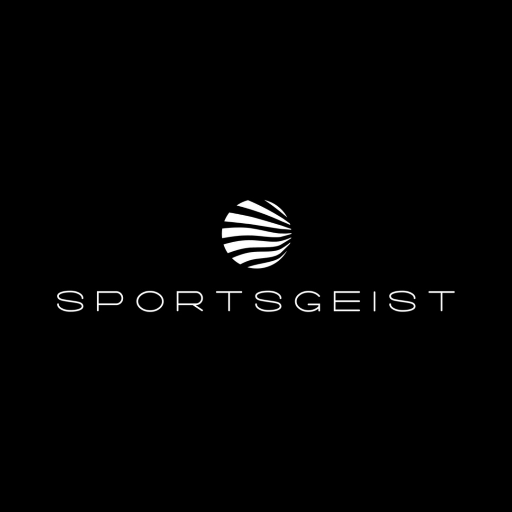
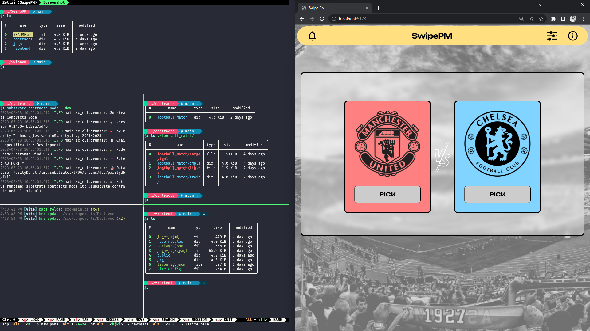

<h3 align="center">SwipePM</h3>
  

    A social competition Sports Prediction App with Zeitgeist
     
    <a href="https://www.figma.com/file/V1W0wKDqXxGYrEH5TFfzJL/SwipePM?type=design&node-id=0%3A1&mode=design&t=cq5XPPpWLxi543Po-1" name="Figma">Figma</a>
    ·
    <a href="https://youtu.be/pBcYVFuj9M0">Youtube</a>
    ·
    <a href="https://github.com/FrankBevr/SwipePM">Code</a>
  

> :exclamation: see state @ submission deadline use `git checkout 5327dbe`

### Screenshot

### Description

Short Summary:
**A social competition Sports Prediction App with Zeitgeist. SwipePM is a feature of the Sports Prediction Platform Sportsgeist.**

Summary:
Sportsgeist is a social competitive peer-to-peer (P2P) Prediction app that revolutionizes the traditional sports betting & prediction experience by offering users the experience to challenge other users, create Teams with your Friends, create Betting Tournaments or create Prediction Pools to bet on collectively. Unlike conventional sports betting, where users are isolated from each other and just place a bet and wait or sell, Sportsgeist empowers a more social, competitive and fun Sports betting experience.

This approach unleashes the power of free markets between users, fostering new opportunities for all participants while enabling them to directly connect with one another. By harnessing the cutting-edge benefits of Web3 technology and the user-friendliness of Web2 technology, Sportsgeist envisions the best of both worlds. This innovative platform will fundamentally change how people invest in their sports knowledge, marking an evolution of Sports Betting to a experience which unleashes the emotions of Sports and why we love it so much.

### Team

| Name          | Discord      | Telegram      | E-mail                 |
| :------------ | :----------- | :------------ | :--------------------- |
| Patrik Bauer  | daredevil3x7 | @daredevil3x7 | `cryyptop@gmail.com`   |
| Frank Dierolf | frankbevr    | @frankbevr    | `frank_dierolf@web.de` |
| Tom           | -            | @morkeltry    | -                      |

### Track - ink! Smart Contracts

Problem:
The sports betting industry is marred by a lack of social interaction, limited user control, and persistent security concerns. Traditional betting platforms offer an isolated experience, lacking a social element, and most importantly, they do not fully leverage the potential of emerging technologies such as mobile applications, blockchain, and Web3. This results in a restrictive environment that inhibits user engagement and trust.

Solution:
Sportsgeist provides an innovative solution to these challenges. By developing a peer-to-peer prediction app, we introduce a social dynamic to the betting industry, enabling users to challenge one another, create teams, and participate in betting tournaments or prediction pools. Our strategy hinges on the integration of advanced Web3 technology for secure transactions, coupled with the user-friendliness of Web2 interfaces. Through this approach, we create a secure, transparent, and interactive environment for sports enthusiasts to engage in betting, ultimately transforming the traditional sports betting experience into a social, competitive, and emotional activity.

### Challenge - Zeitgeist

Elaboration:
Sportsgeist and Zeitgeist are hanging closely together. The initial Idea was use chain extenstion to call `extrinsics::predictionMarkets::createMarket` in our contract. We communicated with Zeitgeist Team to make it happen, but the current state of art doesn't allow it. It will follow soon. A degraded test implentation happend thruh `callRuntime`.
Besides the actually implentation we set up our contract design to map nicely zeitgeist extrinsic.

### Future Plans

In the initial stages, we aim to introduce **Sportsgeist** as an interactive gaming application to familiarize users with its features and promote engagement. Users will have the opportunity to win unique non-fungible tokens **(NFTs)** as part of this interactive experience, adding an exciting element of digital asset ownership.

As we continue to grow and build a **robust user base**, we will progressively **introduce sports betting features**. We will strategically roll these out in **markets with strong user engagement** to ensure a seamless transition and capitalize on the existing momentum. This phased approach will allow us to fine-tune our offerings in response to user feedback, ensuring a tailored and responsive betting experience.

### Tech Stack

| Backend                                                  | Frontend                                                                              |
| :------------------------------------------------------- | :------------------------------------------------------------------------------------ |
| **Rust**, ink!, cargo-contract, substrate-contracts-node | **Typescript**, Vue, UnoCSS, polkadot/api, polkadot/contract, polkadot/extension-dapp |
