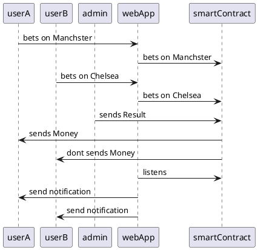

```md
# Header
**wip**

## About The Project
**wip**

### Screenshot
**wip**

### Description
**wip**

#### Summary
**wip**

### Built With
**wip**

## Quickstart 
**wip**

```

## SWE 

To communicate effectivly we are using a simplfied Version of a Software Requirments Sheet.
Sounds fancy, but its just a way to take the Idea, rip it of in smaller chunks without losing the context.

### Idea

- This is a Web Application which allows Users to bet on Manachster or on Chelsea.

**Functional Requirments**

- We nee to build a WebApplication which allows User to bet on Manachster or on Chelsea
- User can bet on Chelsea or on Manchester
- Admin can send Result
- User get bet value transfered
- The Smart Contract is written in ink!
- The Smart Contract is deployed on Zeitgeist.

**Non Functional Requirments**
- The App should have Simple UI


### User Stories

**Epic 1 - User Story**
- As a user, I want to be able to access a web application where I can place bets on Manchester or Chelsea.
- As a user, I want to be able to choose and place a bet on my preferred team between Manchester and Chelsea.
- As a user, I want to receive the bet amount if my chosen team wins the match.
- As a user, I want the web application to have a simple and user-friendly interface.
**Epic 2 - Admin Story**
- As an admin, I want to be able to send the result of the match to the application.
**Epic 3 - Crytpo Story**
- As a smart contract, I want to be written in ink 
- As a smart contract, I want to be deployed on Zeitgeist 

### Diagrams

#### Use Case Diagram
[UserStory](https://www.plantuml.com/plantuml/uml/HOun3e9054JxVugnWuB26z1u0kC1S1db9mjB_euctbwo3TLavatnngefz5cpNRHm9VOy-MQPBq45uUz5c3sOv6KpkJ9nsptXYW5uLCPT9NvcKpgo3J3hdbHlNJ0vlwozMGF3W4RETZv6RlFXyGS0)  


```plantuml
left to right direction
title Epic 1 -  UserStory

actor User 

(bet)
(recieves)

User -- (bet)
User -- (recieves)
```

[AdminStory](https://www.plantuml.com/plantuml/uml/LSqn3i8m44JHVaynT52uuGIXu09m0ijUo4fhEx8d1RV7Kgfqyrypos3it8lBXQiMnURHghX-23Pq-wv4jgw9rghGw8hdPWbt13noiVfcwp-8n3J7GREkGsiUBnsxyoPoS0Wu-p9Zdly1)  


```plantuml
left to right direction
title Epic 2 - AdminStory 

actor Admin 

(sendsResult)

Admin -- (sendsResult)
```

[CryptoStory](https://www.plantuml.com/plantuml/uml/TOyn3i8m34Ltdy9iTEZ41IfLZ1L3Js1IGoAbIUHya7fxCh14YCt_sNhMdoh4yDeZdU1rLovHGgAe3p0oMtXwy1PC7K9EX82eV2t1yOL7dkqeo2ko7KmahWsyxcAOSuArtEZvhhYbsMkiAiCtBfASrmgrHanhZczT1CuFHBrW7Bat_Dbtoj-J_iUaQMkTFm00)  


```plantuml
left to right direction
title Epic 3 - CryptoStory 

actor SmartContract 

(betOnChelsea)
(betOnManchester)
(resolveMatch)

SmartContract -- (betOnChelsea)
SmartContract -- (betOnManchester)
SmartContract -- (resolveMatch)
```

#### Class Diagram
[Contract](https://www.plantuml.com/plantuml/uml/HOv12i8m54JtEKNSATuWgsh1NN7b0NxJmGH-4yaVkn7lhgZOvNi3m-kCqdYVrMsOCCFVL79np5G4tzV29f7UHHKpVwgLewWEmfWURdynj4FmnfRBzOl75KVmNFe4DSXs5_nIy_IpWvIOO4HRXmQhkk3p_RTFrw5CxxuN)  

```plantuml
title: Contract 
class FootballMatch{
+UserA: string
+UserB: string
+betOnChelsea(): void
+betOnManchester(): void
+resolveMatch(): void
}
```

#### Sequence Diagram
[SequenceDiagramm](https://www.plantuml.com/plantuml/uml/VT0nRWGX30NGtgTm3f0BR17jpjRRv0OUnj4WWK7OAChjWqAcO4AsvFlP6AvgLAp602-sSsJCWRn0Rg5tFfCOLkLomp_HCaQqnLFV9w-td8T8OplSarWXPm1zyklRBxtWogQO11yaRbVZ0htIpDWxetsfoRJxpa6PyDcmGSBFOoPEMJR5TzOQ38PQm_sZ3lH8mbzpirnmQz40_rqjU3KMnKECzw0ayn_UaVaaPxDC35nRKcFu1W00)  



### Notes

Everything is simplified. But the overall structure gets crossed.
While we were braindumping. Pat add a simple feature which would be nice.
It introduces Duels. 
Duels are based on 3 Rounds. One Round are three one game.
Besides the logic, the UI would show the Quizduell Circle.
That would drasticially improve this MVP, because the Idea gets instantly cross.
Quizduell Circle --> Quizduell UX.

Read more in [PatFrankBraindumping.md](./Docs/PatFrankBraindumping.md)
