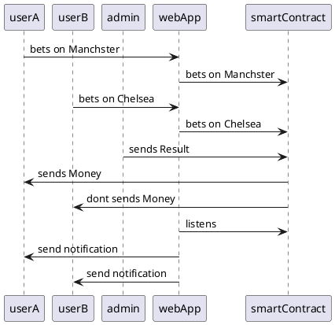

# Braindump 

## Summary

### Idea

- This is a Web Application which allows Users to bet on Manachster or on Chelsea.

**Functional Requirments

- We nee to build a WebApplication which allows User to bet on Manachster or on Chelsea
- User can bet on Chelsea or on Manchester
- Admin can send Result
- User get bet value transfered
- The Smart Contract is written in ink!
- The Smart Contract is deployed on Zeitgeist.

**Non Functional Requirments**
- The App should have Simple UI


### User Stories

*Its directly translated to Epics. See Next Chapter.*

- Epic 1 - User Story
- Epic 2 - Admin Story
- Epic 3 - Crytpo Story

### Diagrams

#### Use Case Diagram

```plantuml
left to right direction
title Epic 1 -  UserStory

actor User 

(bet)
(recieves)

User -- (bet)
User -- (recieves)
```

```plantuml
left to right direction
title Epic 2 - AdminStory 

actor Admin 

(sendsResult)

Admin -- (sendsResult)
```

```plantuml
left to right direction
title Epic 2 - CrptoStory 

actor SmartContract 

(betOnChelsea)
(betOnManchester)
(resolveMatch)

SmartContract -- (betOnChelsea)
SmartContract -- (betOnManchester)
SmartContract -- (resolveMatch)
```

#### Class Diagram
```plantuml
title: Contract 
class FootballMatch{
+UserA: string
+UserB: string
+betOnChelsea(): void
+betOnManchester(): void
+resolveMatch(): void
}
```

#### Sequence Diagram


### Notes

Everything is simplified. But the overall structure gets crossed.

#### Idea of a UserJourney from Frank   

1. Öffnet Browser
2. Geht zu swipe.pm
3. Er sieht eine Card mit zwei knöpfen. Chelsea gegen Manchster.
4. Er ist Pat.
5. Pat drück Manchester.
6. Talisman pop ups.
7. sign transaction / send money
8. warten
9. Transaction durch.
10. pat wartet, refresht browser alle 3minuten.

1. Öffnet Browser
2. Geht zu swipe.pm
3. Er sieht eine Card mit zewi knöpfen. Chelsea gegen Manachster.
4. Er ist Frank
5. Frank drück Chelsea.
6. Talisman pop up.
7. sign transaction / send money
8. warten
9. Transaction druch 
11. frank warte, refresht browser alle 3 minuten.

1. Öffnet Browser
2. Geht zu polkadotJS.org/apps
3. Geht zu developer --> extrinsic --> contract --> call ????
4. Tippt manchester ein.
5. called resolveBet.
6. signs transaction. 
7. waits. 

1. Pat sieht ein 🎉 on top of the Page.
2. Pat geht zu talisman, sieht er hat mehr.
3. Pat is happy.

1. Frank sieht you lost 🥹 on top of the page
2. Frank geht zu talisman, sieht er hat nicht mehr.
3. Frank is sad.


```
_____________________________
|       FootballMatch        |
|____________________________|
| - personA: String          |
| - personB: String          |
|____________________________|
| + betOnChelsea(): void     |
| + betOnManchester(): void  |
| + resolveMatch(): void     |
-----------------------------
```

#### Idea of a UserJourney from Pat   

1. Öffnet Browser
2. Geht zu Sportsgeist
3. Er sieht ein Create Sports Duel
4. Er gibt ein wie viel er setzt
5. Er drückt auf den Button "create"
6. Ein Kreis öffnet sich mit 3 verschiedenen Sportarten
7. Er drückt auf Fußball
8. Swipe öffnet sich mit Chelsea vs. Manchester United
9. Er drückt auf Manchester United
10. Ein Kreis öffnet sich mit 3 verschiedenen Sportarten
11. Er drückt auf Fußball
12. Swipe öffnet sich mit Manchester City vs. Liverpool
13. Er drückt auf Liverpool
14. Ein Kreis öffnet sich mit 3 verschiedenen Sportarten
15. Er drückt auf Fußball
16. Swipe öffnet sich mit Real Madrid vs. Fc Barcelona
17. Er drückt auf Real Madrid
18. Summary Site tritt auf (Amount betted & 3 Picks) mit Button "Launch"
19. Er drückt auf "Launch" 
20. Talisman pops up
21. sign transaction / send money
22. warten
23. Transaction durch.
24. Duel Seite pops up mit "Share" Button
25. Er drückt "Share" und teilt es mit seinem Freund Frank über WhatsApp
26. Er wartet.

0. Öffnet Link in Whatsapp
1. Öffnet Browser
2. Geht zu Sportsgeist
3. Er sieht ein Create Sports Duel
4. Er matcht den Einsatz
5. Er drückt auf den Button "create"
6. Ein Kreis öffnet sich mit 3 verschiedenen Sportarten
7. Er drückt auf Fußball
8. Swipe öffnet sich mit Chelsea vs. Manchester United
9. Er drückt auf Manchester United
10. Ein Kreis öffnet sich mit 3 verschiedenen Sportarten
11. Er drückt auf Fußball
12. Swipe öffnet sich mit Manchester City vs. Liverpool
13. Er drückt auf Liverpool
14. Ein Kreis öffnet sich mit 3 verschiedenen Sportarten
15. Er drückt auf Fußball
16. Swipe öffnet sich mit Real Madrid vs. Fc Barcelona
17. Er drückt auf Barcelona
18. Summary Site tritt auf (Amount betted & 3 Picks) mit Button "Launch"
19. Er drückt auf "Launch" 
20. Talisman pops up
21. sign transaction / send money
22. warten
23. Transaction durch.
24. Duel Seite pops up mit "Share" Button
25. Er drückt "Share" und teilt es mit seinem Freund Frank über WhatsApp
26. Er wartet.

0. Ober Babo enters the space.
1. Öffnet Browser
2. Geht zu polkadotJS.org/apps
3. Geht zu developer --> extrinsic --> contract --> call ????
4. Tippt Chelsea,Manchester City, Real Madrid ein.
5. called resolveBet.
6. signs transaction. 
7. waits and enjoys his babo life further

1. Pat sieht ein "🎉You won the last Duel" on top of the Page.
2. Pat geht zu talisman, sieht er hat mehr.
3. Pat is happy.

1. Frank sieht "🥹you lost your last Duel"  on top of the page
2. Frank geht zu talisman, sieht er hat nicht mehr.
3. Frank is sad.

```
_________________________________________
|       SportsDuel                       |
|________________________________________|
| - personA: String                      |
| - personB: String                      |
|________________________________________|
| + betOnDuel(game1, game2, game3): void |
| + resolveDuel(): void                  |
-----------------------------------------
```
