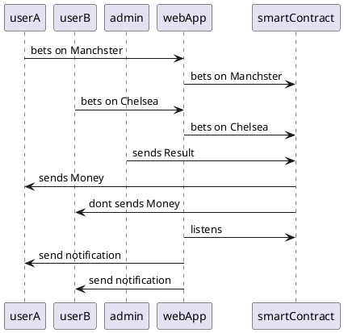

### Diagrams

#### Use Case Diagram
[UserStory](https://www.plantuml.com/plantuml/uml/HOun3e9054JxVugnWuB26z1u0kC1S1db9mjB_euctbwo3TLavatnngefz5cpNRHm9VOy-MQPBq45uUz5c3sOv6KpkJ9nsptXYW5uLCPT9NvcKpgo3J3hdbHlNJ0vlwozMGF3W4RETZv6RlFXyGS0)  


```plantuml
left to right direction
title Epic 1 -  UserStory

actor User 

(bet)
(recieves)

User -- (bet)
User -- (recieves)
```

[AdminStory](https://www.plantuml.com/plantuml/uml/LSqn3i8m44JHVaynT52uuGIXu09m0ijUo4fhEx8d1RV7Kgfqyrypos3it8lBXQiMnURHghX-23Pq-wv4jgw9rghGw8hdPWbt13noiVfcwp-8n3J7GREkGsiUBnsxyoPoS0Wu-p9Zdly1)  


```plantuml
left to right direction
title Epic 2 - AdminStory 

actor Admin 

(sendsResult)

Admin -- (sendsResult)
```

[CryptoStory](https://www.plantuml.com/plantuml/png/TOyn3i8m34Ltdy9iTEZ41IfLZ1L3Js1IGoAbIUHya7fxCh14YCt_sNhMdoh4yDeZdU1rLovHGgAe3p0oMtXwy1PC7K9EX82eV2t1yOL7dkqeo2ko7KmahWsyxcAOSuArtEZvhhYbsMkiAiCtBfASrmgrHanhZczT1CuFHBrW7Bat_Dbtoj-J_iUaQMkTFm00)  


```plantuml
left to right direction
title Epic 3 - CryptoStory 

actor SmartContract 

(betOnChelsea)
(betOnManchester)
(resolveMatch)

SmartContract -- (betOnChelsea)
SmartContract -- (betOnManchester)
SmartContract -- (resolveMatch)
```

#### Class Diagram
[Contract](https://www.plantuml.com/plantuml/uml/HOv12i8m54JtEKNSATuWgsh1NN7b0NxJmGH-4yaVkn7lhgZOvNi3m-kCqdYVrMsOCCFVL79np5G4tzV29f7UHHKpVwgLewWEmfWURdynj4FmnfRBzOl75KVmNFe4DSXs5_nIy_IpWvIOO4HRXmQhkk3p_RTFrw5CxxuN)  


```plantuml
title: Contract 
class FootballMatch{
+UserA: string
+UserB: string
+betOnChelsea(): void
+betOnManchester(): void
+resolveMatch(): void
}
```

#### Sequence Diagram
[SequenceDiagramm](https://www.plantuml.com/plantuml/uml/VT0nRWGX30NGtgTm3f0BR17jpjRRv0OUnj4WWK7OAChjWqAcO4AsvFlP6AvgLAp602-sSsJCWRn0Rg5tFfCOLkLomp_HCaQqnLFV9w-td8T8OplSarWXPm1zyklRBxtWogQO11yaRbVZ0htIpDWxetsfoRJxpa6PyDcmGSBFOoPEMJR5TzOQ38PQm_sZ3lH8mbzpirnmQz40_rqjU3KMnKECzw0ayn_UaVaaPxDC35nRKcFu1W00)  



